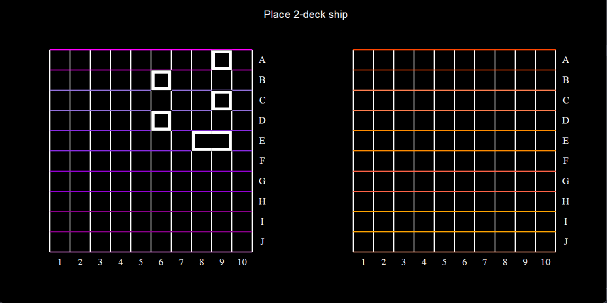

# Sea Battle
## Общая информация
- Этот проект представляет собой игру морской бой с ai соперником
- Действия происходят на двух игровых поля, левое - ваше, правое - соперника(бота)

- Ваша цель поразить все корабли противника до того, как он уничтожит все ваши
## Этапы игры
- На **этапе подготовки** происходит расставление кораблей, в проекте, как и в привычной версии этой игры они предствлены *четырьмя* однопалубными, *тремя* двухпалубными, *двумя* трехпалубными и *одним* четырехпалубным кораблем. На этом этапе в центре экрана будет подсказка, какой именно корабль нужно сейчас поставить, для этого просто поочередно нажмите на смежные по стороне клетки вашего поля. Если выбранный вами корабль расположен некорректно, то вас попросят переставить этот корабль.

- На **этапе игры** вы должны поочередно с ботом наносить выстрелы по кораблям, причем, если выстрел был успешным, то вы, как и бот, получаете право на еще один выстрел без очереди!

- Игра **заканчивается**, когда все корабли одной из сторон уничтожены, в зависимости от результата на экране появится соответствующий текст.


## Установка:

**Чтобы использовать проект, следуйте приложенным инструкциям:**

1. Создайте папку c выбранным именем(*sea_battle_game* у меня) и склонируйте туда этот репозиторий:
```
mkdir sea_battle_game
cd sea_battle_game
git clone git@github.com:seniorfroggy/sea_battle.git
```
2. После этого зайдите в папку с проектом и переключитесь на ветку main:
```
cd sea_battle
git checkout main
```
3. Для использовния проекта, нужно установить все используемые в нем модули, лучше использовать виртуальное окружение:
>  ```python -m venv venv```
> For Linux and MacOs:
> ``` source venv/bin/activate```
> For Windows:
> ```venv\Scripts\activate.bat```
```
pip install -r requirements.txt
chmod +x main.py
```
4. Запуск игры: 
```bash
python3 main.py
```
# Enjoy